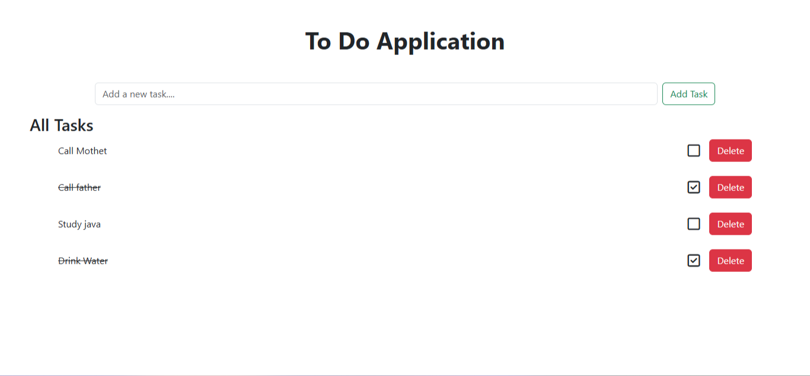

# Full-Stack To-Do List Application

A simple and clean web application to manage your daily tasks. This project was built to demonstrate a full-stack web application using Java Spring Boot for the backend and HTML/CSS/JS for the frontend.

 

---

## ✨ Features

* **Add Tasks**: Quickly add new tasks to your list.
* **Mark as Complete**: Toggle tasks between 'completed' and 'not completed' status with a single click.
* **Delete Tasks**: Remove tasks you no longer need.
* **Responsive UI**: A clean and user-friendly interface that works on both desktop and mobile devices.

---

## 🛠️ Tech Stack

This project is built with the following technologies:

* **Backend**:
    * [Java](https://www.java.com/)
    * [Spring Boot](https://spring.io/projects/spring-boot) - Core framework
    * [Spring Data JPA (Hibernate)](https://spring.io/projects/spring-data-jpa) - Database interaction (ORM)
    * [Maven](https://maven.apache.org/) - Dependency Management
* **Frontend**:
    * [HTML5](https://developer.mozilla.org/en-US/docs/Web/Guide/HTML/HTML5)
    * [CSS3](https://developer.mozilla.org/en-US/docs/Web/CSS)
    * [JavaScript](https://developer.mozilla.org/en-US/docs/Web/JavaScript)
    * [Bootstrap](https://getbootstrap.com/) - Responsive UI framework
* **Database**:
    * [MySQL](https://www.mysql.com/)

---

## 🚀 Getting Started

Follow these instructions to get a copy of the project up and running on your local machine for development and testing purposes.

### Prerequisites

You need to have the following software installed on your machine:
* Java JDK (Version 11 or higher is recommended)
* Apache Maven
* MySQL Server
* Git

### Installation & Setup

1.  **Clone the repository:**
    ```bash
    git clone [https://github.com/](https://github.com/)[your-github-username]/[your-repo-name].git
    cd [your-repo-name]
    ```

2.  **Create the MySQL Database:**
    * Open your MySQL client (e.g., MySQL Workbench or the command line).
    * Create a new database for the project.
    ```sql
    CREATE DATABASE todo_app_db;
    ```

3.  **Configure the Backend:**
    * Navigate to `src/main/resources/`.
    * Open the `application.properties` file.
    * Update the `spring.datasource` properties with your MySQL username and password.

    ```properties
    # MySQL Database Configuration
    spring.datasource.url=jdbc:mysql://localhost:3306/todo_app_db?useSSL=false&serverTimezone=UTC&allowPublicKeyRetrieval=true
    spring.datasource.username=[YOUR_MYSQL_USERNAME]
    spring.datasource.password=[YOUR_MYSQL_PASSWORD]

    # Hibernate Configuration
    spring.jpa.hibernate.ddl-auto=update
    spring.jpa.show-sql=true
    ```
    *Note: `spring.jpa.hibernate.ddl-auto=update` will automatically create the necessary tables based on your Java entity classes the first time you run the application.*

4.  **Run the Application:**
    * Open a terminal in the root directory of the project.
    * Use Maven to build and run the Spring Boot application.
    ```bash
    mvn spring-boot:run
    ```
    * The backend server should now be running on `http://localhost:8080`.

## 🖥️ Usage

Once the application is running, open your web browser and navigate to:

http://localhost:8080

You should see the to-do application interface and be able to add, complete, and delete tasks.

---

## 📝 API Endpoints

The application exposes the following RESTful API endpoints for managing tasks:

| HTTP Method | Endpoint          | Description                      |
|-------------|-------------------|----------------------------------|
| `GET`       | `/api/tasks`      | Get all tasks.                   |
| `POST`      | `/api/tasks`      | Create a new task.               |
| `PUT`       | `/api/tasks/{id}` | Update a task (e.g., mark as complete). |
| `DELETE`    | `/api/tasks/{id}` | Delete a specific task.          |


---

## 📄 License

This project is licensed under the MIT License - see the [LICENSE.md](LICENSE.md) file for details.
